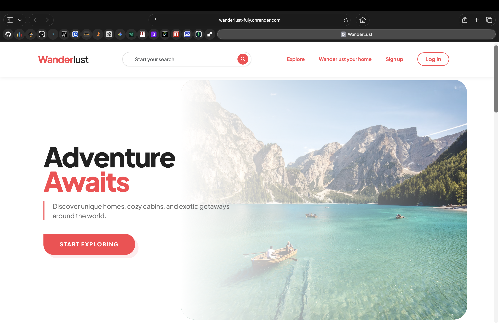
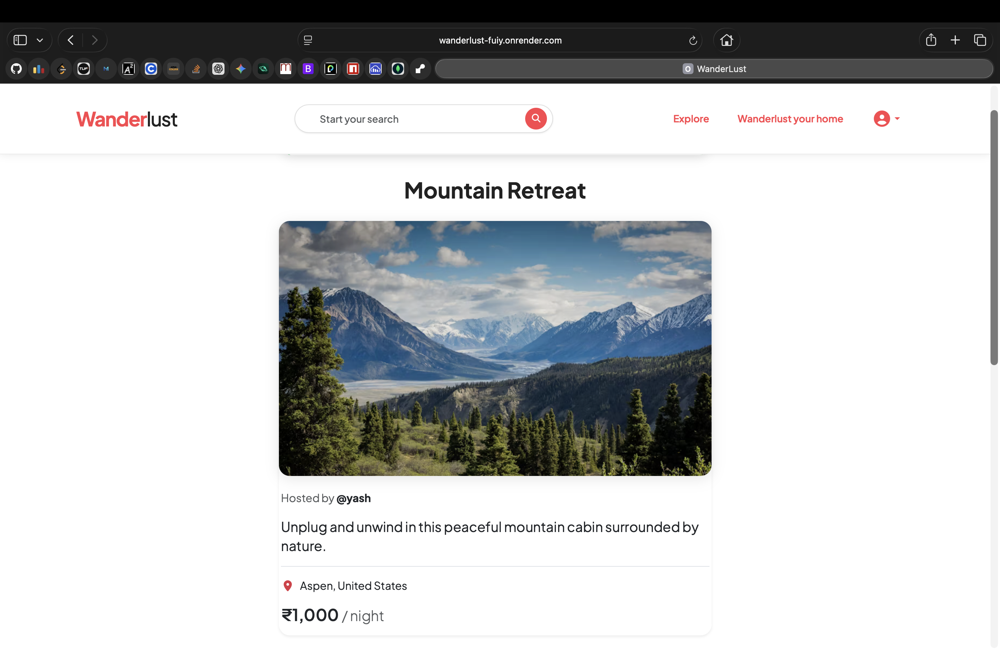
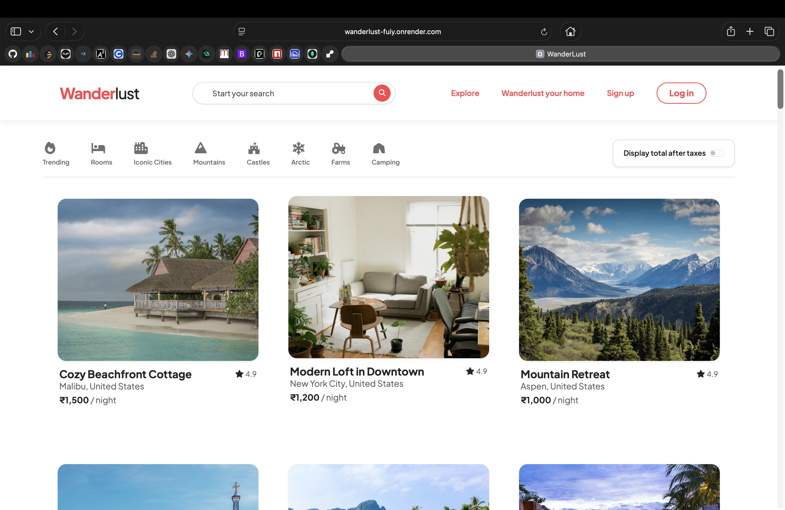
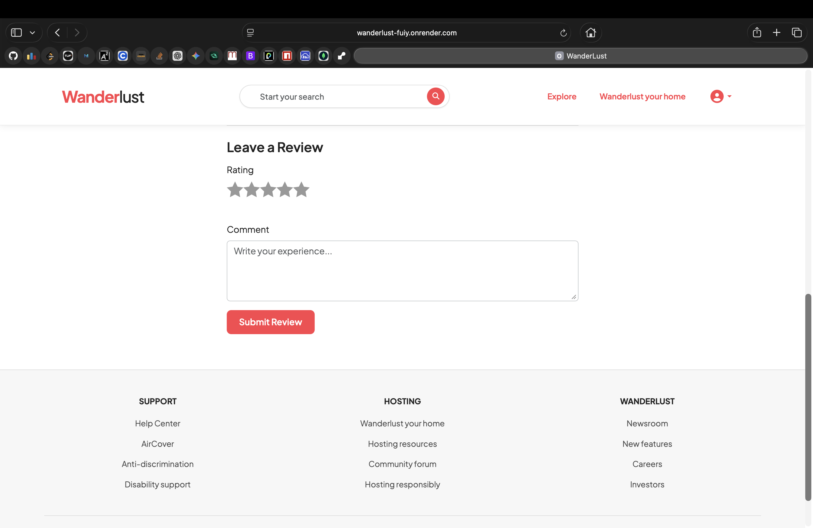

# 🌍 Wanderlust

**Wanderlust** is a full-stack web application inspired by Airbnb that allows users to explore, list, and review travel accommodations.  
The platform supports user authentication, image uploads, dynamic listings, and interactive reviews.

🔗 **Live Site:** https://wanderlust-fuiy.onrender.com

---

## 📸 Screenshots

|              Home Page               |                Listing Details                |
| :----------------------------------: | :-------------------------------------------: |
|  |  |

|              User Dashboard               |            Review System             |
| :---------------------------------------: | :----------------------------------: |
|  |  |

---

## 🚀 Features

- 🔐 User authentication (Sign up / Login / Logout)
- 🏠 Create, edit, and delete property listings
- 📸 Image upload for listings
- ⭐ Review and rating system
- 🔍 Browse and explore listings
- 🧭 Detailed listing pages with descriptions & images
- 📱 Responsive design for different screen sizes
- ⚠️ Flash messages & error handling

---

## 🛠️ Tech Stack

### Frontend

- HTML5
- CSS3
- JavaScript
- EJS (Embedded JavaScript Templates)

### Backend

- Node.js
- Express.js

### Database

- MongoDB
- Mongoose

### Authentication & Security

- Passport.js
- Express-session
- bcrypt

### File Upload & Storage

- Multer
- Cloudinary

### Tools & Deployment

- Git & GitHub
- Render (Deployment)

---

## ⚙️ Local Setup Instructions

To run this project on your local machine:

1.  **Clone the repository:**

    ```bash
    git clone [https://github.com/yash07-bit/wanderlust.git](https://github.com/yash07-bit/wanderlust.git)
    cd wanderlust
    ```

2.  **Install dependencies:**

    ```bash
    npm install
    ```

3.  **Environment Variables:** Create a `.env` file in the root directory and add your credentials:

    ```env
    CLOUD_NAME=your_cloudinary_name
    CLOUD_API_KEY=your_api_key
    CLOUD_API_SECRET=your_api_secret
    ATLASDB_URL=your_mongodb_connection_url
    SECRET=your_session_secret_key
    ```

4.  **Start the server:**
    ```bash
    node app.js
    ```
    _Open `http://localhost:8080` to view the app._

---

**Built with ❤️ by Yash**
